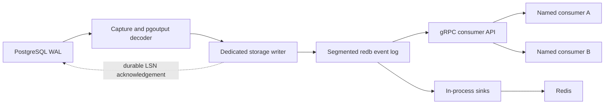

# lightcdc

[](https://github.com/EricH10/lightcdc/actions/workflows/ci.yml)
[](rust-toolchain.toml)
[](#license)

LightCDC is a single-node PostgreSQL change data capture runtime written in
Rust. It durably moves committed logical-replication changes into a local event
log, then lets independent consumers and built-in sinks process those changes
at their own pace.

The first release focuses on a dependable local CDC building block: global
event order, atomic source checkpoints, bounded storage, crash recovery, and
explicit consumer replay semantics without requiring Kafka or a second service
for internal durability.

## Highlights

- PostgreSQL 17 logical replication with `pgoutput` decoding.
- Transaction-atomic persistence of events and source LSNs.
- Segmented redb event log with count, byte, and age retention.
- Named gRPC consumers with independent durable offsets, cumulative ACKs, and
  explicit seek behavior.
- Config-defined streams and capture-side table filtering.
- Disk-backed staging for transactions that exceed the in-memory threshold.
- In-process sink runtime with an optional replay-safe Redis connector.
- TLS, bearer-token authentication, bounded API resources, graceful shutdown,
  and stable operational exit codes.
- Prometheus metrics, integrity checks, checksummed backup and restore, and
  Docker-backed crash and recovery tests.

## Architecture



Capture acknowledges PostgreSQL only after a complete source transaction and
its source LSN are durable. Consumers acknowledge their own ordered offsets
independently, so a slow or disconnected consumer does not stop capture or
another consumer.

See [Architecture](docs/architecture.md) and [Code Flow](docs/code-flow.md) for
the detailed concurrency and data-flow model.

## Measured Capacity

The initial measured single-consumer envelope is **50,000 events/second** for
100-row source transactions, a 256-byte compressible payload, ACKs every 5,000
events, active retention, and the documented high-throughput batching profile.

A 10-minute 60k/s boundary run delivered all 35.7 million events, but periodic
storage and retention stalls pushed worst one-second p99 latency to 16.2
seconds. LightCDC therefore publishes 50k/s as the operating envelope and
treats 60k/s as workload-specific headroom, not a universal guarantee.

Capacity depends on transaction size, payload shape, storage, retention,
consumer count, and acknowledgement cadence. Re-run the included harness on
the target system before choosing a production rate. See the
[production capacity baseline](docs/benchmarks/2026-08-02-production-capacity.md),
[Linux boundary run](docs/benchmarks/2026-08-28-linux-capacity.md), and
[benchmark guide](bench/README.md).

## Quick Start

Prerequisites:

- Rust 1.89 or newer
- Docker with Docker Compose

Start PostgreSQL and Redis:

```bash
docker compose up -d --wait postgres redis
```

Run capture, the gRPC API, and configured sinks in one process:

```bash
cargo run -p lightcdc-cli -- run --config lightcdc.example.toml
```

In another terminal, subscribe a named consumer and generate a 32-event demo
transaction:

```bash
cargo run -p lightcdc-api --example consumer -- \
  --stream orders \
  --consumer example-printer \
  --seed-sql sql/demo_orders.sql \
  --limit 32
```

The consumer prints inserts, updates, and deletes as they arrive and
cumulatively acknowledges its durable position. Stop LightCDC with `Ctrl-C`;
the runtime drains bounded in-flight work before exiting.

## Configuration

[lightcdc.example.toml](lightcdc.example.toml) documents the complete local
configuration, including:

- PostgreSQL connection, publication, slot, and TLS settings.
- Runtime, transaction, storage, retention, and disk-safety limits.
- gRPC authentication and transport limits.
- Stream-to-table selection.
- Redis sink routing and key mapping.
- Logging and Prometheus metrics.

Production credentials can come from environment variables or mounted files.
Plaintext unauthenticated gRPC is accepted only on a loopback bind. The
[operations runbook](docs/operations.md) covers least-privilege roles, secret
handling, deployment, health probes, backup, restore, failover boundaries, WAL
growth, and disk pressure.

## Delivery Contract

LightCDC provides ordered, at-least-once delivery from its durable local log:

- A consumer name identifies one durable cursor within one stream.
- `Subscribe` starts at that cursor unless the consumer explicitly seeks.
- `Ack` advances monotonically and never moves a cursor backward.
- Redelivery is possible after a consumer processes an event but crashes before
  acknowledging it.
- Retention does not wait forever for abandoned consumers; an expired cursor
  fails explicitly and requires an operator-selected seek.

The protobuf contract is in
[lightcdc.proto](crates/lightcdc-api/proto/lightcdc/v1/lightcdc.proto). Any gRPC
language can generate a compatible client; the Rust example is only a reference
consumer. See [Consumer Delivery](docs/consumer-delivery.md) for the complete
contract.

## Current Boundaries

- PostgreSQL 17 is the validated source version.
- Capture is change-only; an initial snapshot or backfill must be coordinated
  externally.
- One LightCDC process owns one data directory. Host loss requires restart or
  offline restore; there is no automatic active-active failover.
- The local event log preserves one global sequence. Writer partitioning and
  shared leased-consumer groups are future scale features.
- Supported `pgoutput` behavior and known schema limitations are listed in
  [PostgreSQL Support](docs/postgres-support.md).
- WASM transforms and webhook destinations are roadmap items, not current
  release features.

## Production Image

Build and verify the pinned Debian Bookworm image:

```bash
docker build -t lightcdc:0.1.0 .
docker run --rm lightcdc:0.1.0 --version
```

The image runs as UID/GID 10001. Production deployment requires a read-only
configuration mount, mounted secrets, and a persistent `/var/lib/lightcdc`
volume.

## Development

Run the local quality suite:

```bash
cargo fmt --all --check
cargo clippy --workspace --all-targets --locked -- -D warnings
cargo test --workspace --locked
cargo deny check
```

Run Docker-backed PostgreSQL and Redis integration tests:

```bash
docker compose up -d --wait postgres redis
cargo test -p lightcdc-cli --test capture_integration --locked -- --ignored --test-threads=1
cargo test -p lightcdc-redis --locked -- --ignored --test-threads=1
```

See [Local Development](docs/local-development.md),
[Debugging](docs/debugging.md), and [Contributing](CONTRIBUTING.md) before making
larger changes.

## Documentation

| Document | Purpose |
| --- | --- |
| [Architecture](docs/architecture.md) | Component boundaries, concurrency, and durable data flow |
| [Operations](docs/operations.md) | Deployment, health, recovery, backup, upgrades, and failure handling |
| [Consumer Delivery](docs/consumer-delivery.md) | Subscribe, ACK, seek, replay, and expiration semantics |
| [PostgreSQL Support](docs/postgres-support.md) | Source setup, feature matrix, schema behavior, and bootstrap boundary |
| [Redis Connector](docs/redis-connector.md) | Built-in sink configuration and replay-safe behavior |
| [Metrics](docs/metrics.md) | Prometheus contract and starting alert thresholds |
| [Roadmap](docs/roadmap.md) | Completed release gate and remaining product and scale milestones |

## License

Licensed under either the [MIT License](LICENSE-MIT) or the
[Apache License, Version 2.0](LICENSE-APACHE), at your option.
